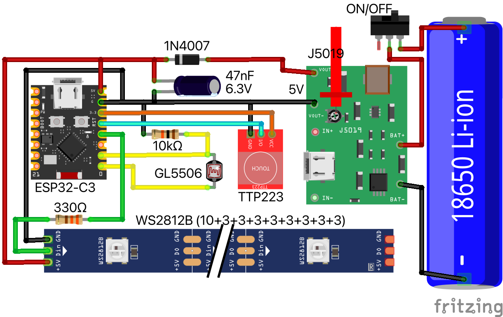
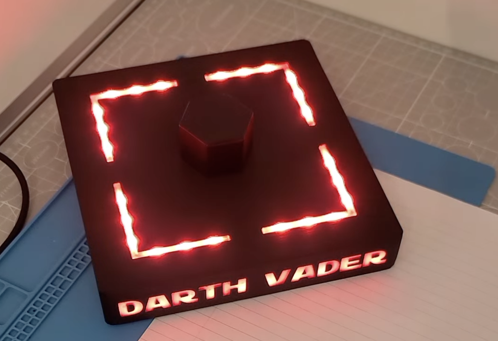

## LED light for Darth Vader 3D printed base 
WS2812B and ESP-32-C3-SuperMini based LED light that contains a few modes and effects, a light sensor and a touch button.
The Base can be powered from an external 5V power supply or from the included Li-ion battery.

### Main components
1. ESP32-C3 SuperMIni
2. BMS-Boost convertor J5019
3. Touch sensor TTP223 (HW-763)
4. 42 WS2812B leds
5. Li-Ion 18650 3.7V battery
6. Photoresistor GL5506 (5-500KΩ)

### Modes
1. 100% Red light
2. 60% Red light
3. 30% Red light
4. Light sensor mode
5. Wave-breath mode
6. Run wave mode

### Notes
1. Before connecting ESP board, be sure that the boost converter provides 5-5.5V
2. Good to add a diode before the ESP board to prevent back voltage if the board is on the wiring mode.
3. Capacitor 47-470mf - noise filter.
4. Resistors 330Ω - is protection resistors, place the resistors as close as possible to the ESP32 pin for maximum effectiveness.
5. LEDs are connected in the chain 10 - front text backlight, (3+3)+(3+3)+(3+3)+(3+3) - bust highlighting.
6. The full system power at 100% brightness is 5W-ish (1300mA at 3.7V). Please note this if you are going to use it in autonomous mode.

### Schema

### License

This project is licensed under the Apache License, Version 2.0.

You are free to use, modify, and distribute this software under the terms of the Apache 2.0 License. See the [LICENSE](LICENSE.txt) file for details.

#### Key Points:
- **Attribution**: You must give proper credit to the original author(s).
- **Modifications**: If you modify the code, you must clearly indicate what changes were made.
- **No Liability**: The software is provided "as-is" without any warranty.

For more information, refer to the full [Apache 2.0 License](https://www.apache.org/licenses/LICENSE-2.0).
